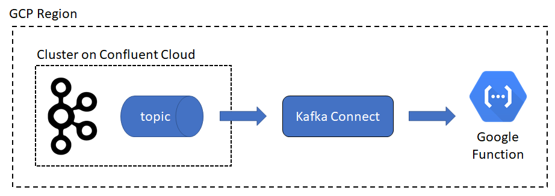

# Connecting Confluent Cloud with Google Functions

This example shows how to send records from a topic to a Google Function using Kafka Connect. Every record sent to a topic named 'myfunction' would be sent to a function running on Google Functions. This integration is done by Kafka Connect using an HTTP Connector.

<p align="center">
    
</p>

This example requires an Apache Kafka cluster running on Confluent Cloud, as well as access to Google Cloud for creating the required resources to host Kafka Connect. You don't need to have any knowledge about Google Cloud or Google Functions since everything will be created by code for you.

Requirements
----------

- You must have a **Confluent Cloud** account. Click [here](https://confluent.cloud/signup) to sign up.
- Install **Confluent Cloud CLI**. You can find instructions [here](https://docs.confluent.io/current/cloud/cli/install.html).
- Install **JSON Processor** utility. You can find instructions [here](https://stedolan.github.io/jq/download/).
- Install the **NPM** utility. You can find instructions [here]https://www.npmjs.com/get-npm).
- Install **Terraform**. You can find instructions [here](https://www.terraform.io/downloads.html).
- Install **Serverless**. You can find instructions [here](https://serverless.com/framework/docs/getting-started/).

Main Steps
----------

1) Create a Confluent Cloud cluster. You can find instructions [here](https://docs.confluent.io/current/quickstart/cloud-quickstart.html#cloud-quickstart).

2) Create a topic named 'myfunction'. If you have the Confluent Cloud CLI installed and properly initialized, you can use the following command:

```bash
    $ ccloud topic create myfunction <ENTER>
```

3) Create an service account in your GCP project, making sure that the service account has the following roles:
- Compute Network Admin
- Compute Admin
- Storage Admin
- Logging Admin
- Deployment Manager Editor
- Cloud Functions Developer

4) Create a JSON Key for the service account. Store the JSON key in the 'credentials' folder using 'keyfile.json' as the name of the file.

5) Edit the file 'serverless/serverless.yml', and replace <PROJECT_NAME> with the name of your GCP project.

6) Initialize the Google Functions plugins by running the following commands:

```bash
    $ cd serverless <ENTER>
    $ npm install <ENTER>
```
7) Deploy your Google Function by running the following command:

```bash
    $ cd serverless <ENTER>
    $ serverless deploy -v <ENTER>
```

Take a note of the endpoint URL that is printed when the deployment finishes.

8) Create a copy of the file 'terraform/gcp/endpoint.auto.tfvars.example' and rename the new file to 'terraform/gcp/endpoint.auto.tfvars'.

9) Edit the file 'terraform/gcp/endpoint.auto.tfvars', and replace <GOOGLE_FUNCTION_ENDPOINT> with the endpoint that you copied on step 7.

10) Create a copy of the file 'terraform/gcp/ccloud.auto.tfvars.example' and rename the new file to 'terraform/gcp/ccloud.auto.tfvars'.

11) Edit the file 'terraform/gcp/ccloud.auto.tfvars', and replace each one of the values with the correspondent information from your Kafka cluster.

12) Create a copy of the file 'terraform/gcp/cloud.auto.tfvars.example' and rename the new file to 'terraform/gcp/cloud.auto.tfvars'.

13) Edit the file 'terraform/gcp/cloud.auto.tfvars', and replace <YOUR_GCP_PROJECT> with the value of your GCP project.

14) Deploy Kafka Connect into GCP using Terraform. For this, run the following command:

```bash
    $ cd terraform/gcp <ENTER>
    $ terraform apply -auto-approve <ENTER>
```

15) Once Terraform finishes, wait until the Kafka Connect Load Balancer is ready for business. You can try use the URL that is shown by the end of the Terraform script to see if it works.

16) Deploy the HTTP connector by running the following command:

```bash
    $ cd terraform/gcp <ENTER>
    $ ./connector.sh <ENTER>
```

At this point, you should be able to produce records to the topic 'myfunction', and those records will be sent to the function running on Google Functions.

License
-------

The project is licensed under the Apache 2 license.